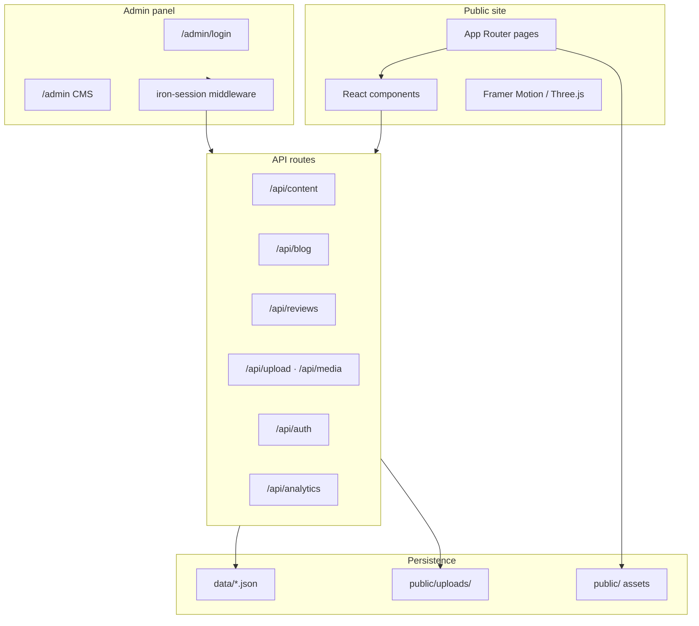

<div align="center">

# Ahmad Al-Halwany — Developer Portfolio

**Production-grade personal portfolio & CMS — built to impress recruiters, clients, and engineering teams.**

[](https://portfolio-xi-opal-35.vercel.app)
[](https://nextjs.org/)
[](https://www.typescriptlang.org/)
[](https://tailwindcss.com/)

[🌐 Live site](https://portfolio-xi-opal-35.vercel.app) · [💼 LinkedIn](https://www.linkedin.com/in/ahmad-alhalwany/) · [🐙 GitHub](https://github.com/ahmad-alhalwany) · [📧 Contact](mailto:ahmad.s.alhalwany@gmail.com)

</div>

---

## Overview

A **full-stack developer portfolio** that goes far beyond a static landing page. This project combines a cinematic, motion-rich public site with a **password-protected admin CMS**, bilingual content (EN / DE), blog, testimonials, analytics, and SEO tooling — all editable without touching code.

Built by **Ahmad Al-Halwany** — Full-Stack Developer (Python · Next.js · TypeScript · Django).

| | |
|---|---|
| **Live** | [portfolio-xi-opal-35.vercel.app](https://portfolio-xi-opal-35.vercel.app) |
| **Stack** | Next.js 14 · React 18 · TypeScript · Tailwind CSS · Framer Motion |
| **CMS** | JSON-backed content + `/admin` panel with media uploads |
| **i18n** | English + German (locale toggle, admin-managed overrides) |
| **Deploy** | Vercel-ready · Sentry · GA4 |

---

## Highlights

- **🎯 Hire-ready homepage** — Animated hero, skills, services, work experience, education, stats, testimonials, blog preview, and contact — all CMS-driven.
- **🛠 Full admin panel** — Edit hero, about, projects, blog posts, reviews, certificates, languages, contact, and locale strings from the browser.
- **📁 Rich project pages** — Case studies, metrics, tech stacks, live demos, GitHub links, and screenshot galleries with lightbox.
- **📊 Impact & Growth section** — Certificate stats, learning paths, Coursera integrations, and animated charts.
- **🌍 3D & motion** — Three.js globe for reviews, Framer Motion scroll reveals, page transitions, and micro-interactions.
- **🔒 Production hardening** — Iron-session admin auth, honeypot + rate limits on forms, Sentry error tracking, JSON-LD SEO, sitemap & OG images.
- **📬 Lead capture** — Hire inquiry form, Calendly embed, newsletter (Buttondown + local fallback), EmailJS contact.

---

## Feature map

### Public site

| Section | Description |
|--------|-------------|
| **Hero** | Flip words, skill chips, CV download, availability badge |
| **About** | Manifest timeline, principles, meta cards |
| **Projects** | Carousel + detail pages with gallery & case study |
| **Experience** | Filterable roles (full-time · internship · freelance) |
| **Education** | Degrees + verified Coursera certificates |
| **Stats** | Certificates by year, active courses, learning paths |
| **Testimonials** | Globe visualization, star ratings, visitor submissions |
| **Blog** | Markdown/HTML articles, comments, 3D marquee covers |
| **Contact** | Hire form, Calendly, social links, CV showcase |

### Admin CMS (`/admin`)

| Module | Capabilities |
|--------|----------------|
| **Content** | Hero, About, Grid, Skills, Services, Approach |
| **Portfolio** | Projects, galleries, tech icons, case study fields |
| **Career** | Work experience, education, stats & certificates |
| **Community** | Reviews moderation, blog CRUD, comment moderation |
| **Media** | Image upload, CV PDF upload, project screenshots |
| **Locale** | German translation overrides for all sections |
| **Analytics** | Built-in page-view tracking dashboard |

---

## Tech stack

**Frontend**
Next.js 14 (App Router) · React 18 · TypeScript · Tailwind CSS · Framer Motion · Three.js / React Three Fiber · tsparticles · React Quill · next-themes

**Backend & data**
Next.js Route Handlers · JSON file store (`data/content.json`, `data/blog.json`, `data/reviews.json`) · iron-session · bcryptjs · sharp

**Integrations**
EmailJS · Nodemailer · Google Analytics 4 · Sentry · Buttondown · Calendly

**Tooling**
ESLint · PostCSS · Turbopack dev mode

---

## Architecture



---

## Project structure

```
protfolio/
├── app/                    # Next.js App Router (pages + API)
│   ├── admin/              # CMS dashboard & login
│   ├── api/                # REST endpoints (content, blog, auth, upload…)
│   ├── blog/               # Blog listing & article pages
│   ├── projects/           # Project detail pages
│   ├── experience/         # Career timeline page
│   └── education/          # Certificates & education page
├── components/             # UI, sections, admin, motion, i18n
├── data/                   # CMS JSON (content, blog, reviews)
├── lib/                    # Types, SEO, auth, content helpers
├── public/                 # Static assets, uploads, resume PDF
├── scripts/                # Setup & certificate sync utilities
└── middleware.ts           # Admin route protection
```

---

## Quick start

### Prerequisites

- **Node.js** 18+
- **npm** 9+

### 1. Clone & install

```bash
git clone https://github.com/ahmad-alhalwany/portfolio.git
cd protfolio
npm install
```

### 2. Environment variables

Copy the example file and fill in your values:

```bash
cp .env.example .env.local
```

| Variable | Required | Purpose |
|----------|----------|---------|
| `NEXT_PUBLIC_SITE_URL` | ✅ Production | Canonical URL for SEO, OG, sitemap |
| `ADMIN_PASSWORD` | ✅ | Admin login password |
| `IRON_SESSION_PASSWORD` | ✅ | 32+ char secret for encrypted sessions |
| `NEXT_PUBLIC_SERVICE_ID` | Optional | EmailJS service ID |
| `NEXT_PUBLIC_TEMPLATE_ID` | Optional | EmailJS template ID |
| `NEXT_PUBLIC_USER_ID` | Optional | EmailJS public key |
| `UPSTASH_REDIS_REST_URL` | ✅ Vercel | Shared storage for reviews, comments, subscribers |
| `UPSTASH_REDIS_REST_TOKEN` | ✅ Vercel | Upstash REST token |
| `NEXT_PUBLIC_GA_MEASUREMENT_ID` | Optional | Google Analytics 4 |
| `NEXT_PUBLIC_CALENDLY_URL` | Optional | Calendly booking link |
| `BUTTONDOWN_API_KEY` | Optional | Newsletter via Buttondown |
| `SENTRY_AUTH_TOKEN` | Optional | Sentry build & error reporting |

Generate a secure session secret:

```bash
node -e "console.log(require('crypto').randomBytes(32).toString('hex'))"
```

### 3. Run locally

```bash
# Development (Turbopack)
npm run dev

# Production preview (build + start)
npm run preview
```

Open [http://localhost:3000](http://localhost:3000) — admin panel at [http://localhost:3000/admin](http://localhost:3000/admin).

---

## Scripts

| Command | Description |
|---------|-------------|
| `npm run dev` | Dev server with Turbopack |
| `npm run dev:webpack` | Dev server with Webpack |
| `npm run dev:clean` | Clean `.next` cache then dev |
| `npm run build` | Production build |
| `npm run start` | Start production server |
| `npm run preview` | Build + start (local prod test) |
| `npm run lint` | ESLint |
| `npm run clean` | Remove `.next` cache |
| `npm run setup:community` | Seed community/review setup |
| `npm run sync:certs` | Sync education certificates |

---

## Deployment (Vercel)

1. Push the repo to GitHub.
2. Import the project in [Vercel](https://vercel.com).
3. Set **all required env vars** in Vercel → Settings → Environment Variables.
4. Deploy.

> **Important for CMS & uploads:** Commit `data/content.json`, `data/blog.json`, and `data/reviews.json` so production reflects your content. Uploaded media lives under `public/uploads/` — commit new uploads or use persistent storage for high-volume production.

**Checklist before go-live:**

- [ ] `NEXT_PUBLIC_SITE_URL` set to your domain
- [ ] `ADMIN_PASSWORD` + `IRON_SESSION_PASSWORD` set (strong values)
- [ ] Upstash Redis vars set for reviews/comments on Vercel
- [ ] EmailJS or hire API configured for contact
- [ ] CV PDFs present at `public/resume/ahmad-alhalwany-cv-en.pdf` and `public/resume/ahmad-alhalwany-cv-de.pdf`, or uploaded via admin

---

## Admin access

| | |
|---|---|
| **URL** | `/admin` |
| **Auth** | Password via `ADMIN_PASSWORD` env var |
| **Session** | Encrypted cookie (iron-session) |
| **Protected** | Middleware blocks all `/admin/*` except login |

Use the admin panel to update copy, projects, blog posts, reviews, stats, and German translations — changes persist to JSON files via `/api/content`.

---

## SEO & performance

- Dynamic **Open Graph** image generation
- **JSON-LD** structured data (Person, WebSite, projects, articles)
- **`sitemap.ts`** + **`robots.ts`** + **`manifest.ts`**
- **Dynamic imports** + skeleton loaders for heavy sections
- **Image optimization** via `next/image` + Sharp
- **Dark / light theme** with system preference support

---

## Author

**Ahmad Al-Halwany** — Full-Stack Developer

- 🌐 Portfolio: [portfolio-xi-opal-35.vercel.app](https://portfolio-xi-opal-35.vercel.app)
- 💼 LinkedIn: [linkedin.com/in/ahmad-alhalwany](https://www.linkedin.com/in/ahmad-alhalwany/)
- 🐙 GitHub: [github.com/ahmad-alhalwany](https://github.com/ahmad-alhalwany)
- 📧 Email: [ahmad.s.alhalwany@gmail.com](mailto:ahmad.s.alhalwany@gmail.com)

---

<div align="center">

**Open to full-time roles · Python · Next.js · TypeScript · Django**

If this project helped you or you'd like to collaborate — ⭐ star the repo or reach out.

</div>
